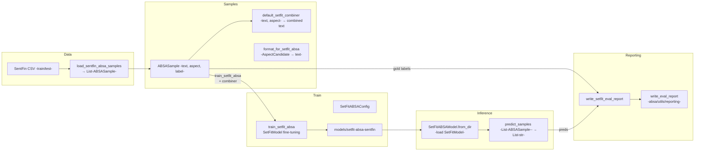

## SetFit ABSA package (`sentalyzer/absa/setfitUtil`) - Training & inference

```mermaid
flowchart LR
    subgraph Data
        D1[SentFin CSV -train/test-]
        D2[load_sentfin_absa_samples \n→ List-ABSASample-]
    end

    subgraph Samples
        S1[ABSASample -text, aspect, label-]
        C1[default_setfit_combiner \n -text, aspect- → combined text]
        FMT[format_for_setfit_absa \n -AspectCandidate → text-]
    end

    subgraph Train
        CFG[SetFitABSAConfig]
        T1[train_setfit_absa \n SetFitModel fine-tuning]
        MDIR[models/setfit-absa-sentfin]
    end

    subgraph Inference
        M1[SetFitABSAModel.from_dir \n -load SetFitModel-]
        P1[predict_samples \n -List-ABSASample-- → List-str-]
    end

    subgraph Reporting
        R1[write_setfit_eval_report]
        R2[write_eval_report \n -absa/utils/reporting-]
    end

    D1 --> D2 --> S1
    S1 --> C1

    S1 -->|train_setfit_absa\n+ combiner| T1 --> MDIR
    MDIR --> M1 --> P1

    S1 -->|gold labels| R1
    P1 -->|preds| R1 --> R2
```

