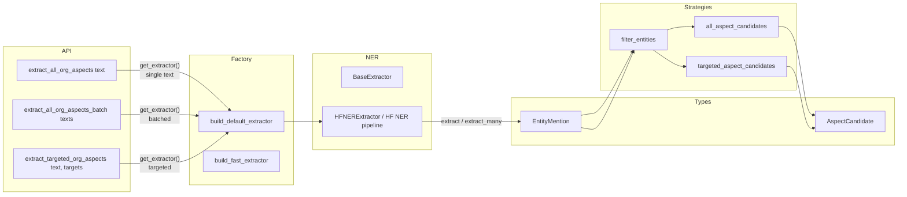

## Extraction package (`sentalyzer/extraction`) - High-level flow

```mermaid
flowchart LR
    subgraph API
        A1[extract_all_org_aspects text]
        A2[extract_all_org_aspects_batch texts]
        A3[extract_targeted_org_aspects text, targets]
    end

    subgraph Factory
        F1[build_default_extractor ]
        F2[build_fast_extractor]
    end

    subgraph NER
        B[BaseExtractor]
        H[HFNERExtractor / HF NER pipeline]
    end

    subgraph Types
        T1[EntityMention]
        T2[AspectCandidate]
    end

    subgraph Strategies
        S1[filter_entities]
        S2[all_aspect_candidates]
        S3[targeted_aspect_candidates]
    end

    A1 -->|"get_extractor()"\nsingle text| F1 --> H
    A2 -->|"get_extractor()"\nbatched| F1
    A3 -->|"get_extractor()"\ntargeted| F1

    H -->|"extract / extract_many"| T1
    T1 --> S1 --> S2 --> T2
    T1 --> S1 --> S3 --> T2
```

