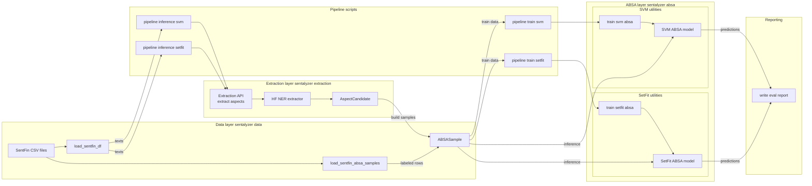

## Sentalyzer overall architecture - Data → NER → ABSA → Reports

```mermaid
flowchart LR
    subgraph DataLayer[Data layer sentalyzer data]
        DCSV[SentFin CSV files]
        LDF[load_sentfin_df]
        LABSA[load_sentfin_absa_samples]
        SAMPLES[ABSASample]
    end

    subgraph ExtractionLayer[Extraction layer sentalyzer extraction]
        EAPI[Extraction API\nextract aspects]
        EXTR[HF NER extractor]
        AC[AspectCandidate]
    end

    subgraph ABSALayer[ABSA layer sentalyzer absa]
        subgraph SVM[SVM utilities]
            STRAIN[train svm absa]
            SMODEL[SVM ABSA model]
        end
        subgraph SetFit[SetFit utilities]
            FTRAIN[train setfit absa]
            FMODEL[SetFit ABSA model]
        end
    end

    subgraph Reports[Reporting]
        RJSON[write eval report]
    end

    subgraph Scripts[Pipeline scripts]
        PTrainSVM[pipeline train svm]
        PTrainSetFit[pipeline train setfit]
        PInferSVM[pipeline inference svm]
        PInferSetFit[pipeline inference setfit]
    end

    %% data loading
    DCSV --> LDF
    DCSV --> LABSA
    LABSA -->|labeled rows| SAMPLES

    %% training flows
    SAMPLES -->|train data| PTrainSVM --> STRAIN --> SMODEL
    SAMPLES -->|train data| PTrainSetFit --> FTRAIN --> FMODEL

    %% inference flows with extraction
    LDF -->|texts| PInferSVM --> EAPI
    LDF -->|texts| PInferSetFit --> EAPI
    EAPI --> EXTR --> AC
    AC -->|build samples| SAMPLES

    %% ABSA prediction and reporting
    SAMPLES -->|inference| SMODEL -->|predictions| RJSON
    SAMPLES -->|inference| FMODEL -->|predictions| RJSON
```
